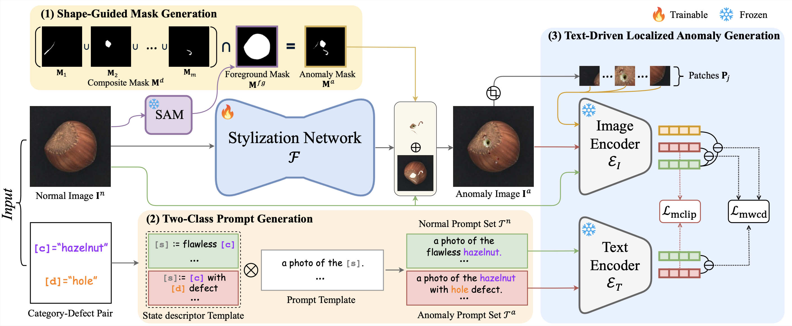

# [AAAI 2026] AnoStyler: Text-Driven Localized Anomaly Generation via Lightweight Style Transfer

**Yulim So¹**, **Seokho Kang¹**  
¹Sungkyunkwan University  

[](https://arxiv.org/abs/2511.06687)
[](LICENSE)
[]()

---

## Abstract
Anomaly generation has been widely explored to address the scarcity of anomaly images in real-world data. However, existing methods typically suffer from at least one of the following limitations, hindering their practical deployment: (1) lack of visual realism in generated anomalies; (2) dependence on large amounts of real images; and (3) use of memory-intensive, heavyweight model architectures. To overcome these limitations, we propose _AnoStyler_, a lightweight yet effective method that frames zero-shot anomaly generation as text-guided style transfer. Given a single normal image along with its category label and expected defect type, an anomaly mask indicating the localized anomaly regions and two-class text prompts representing the normal and anomaly states are generated using generalizable category-agnostic procedures. A lightweight U-Net model trained with CLIP-based loss functions is used to stylize the normal image into a visually realistic anomaly image, where anomalies are localized by the anomaly mask and semantically aligned with the text prompts. Extensive experiments on the MVTec-AD and VisA datasets show that _AnoStyler_ outperforms existing anomaly generation methods in generating high-quality and diverse anomaly images. Furthermore, using these generated anomalies helps enhance anomaly detection performance.




---

## Installation
Create a new conda environment:
```bash
conda create -n anostyler python=3.10
conda activate anostyler
pip install -r requirements.txt
```

Or install manually:
```bash
pip install torch==2.5.1 torchvision==0.20.1
pip install numpy==2.3.2 opencv-contrib-python==4.11.0.86 Pillow==11.3.0 scipy==1.16.1 tqdm==4.67.1
pip install git+https://github.com/openai/CLIP.git
pip install git+https://github.com/facebookresearch/segment-anything.git
```

---

## Dataset & Checkpoint Download
We provide a helper script at `script/download.sh` (edit the links to your mirrors):

```bash
# /path/to/AnoStyler/script/download.sh

# Download MVTec-AD dataset
mkdir -p datasets/MVTec-AD && cd datasets/MVTec-AD
wget <download_link_to_MVTec_AD_dataset>
cd -

# Download VisA dataset
mkdir -p datasets/VisA && cd datasets/VisA
wget <download_link_to_VisA_dataset>
cd -

# Download SAM model checkpoint
mkdir -p checkpoints && cd checkpoints
wget <download_link_to_sam_checkpoint>
cd -
```

Usage:
```bash
bash script/download.sh
```

Datasets:
- **MVTec-AD** (Bergmann et al., CVPR 2019)
- **VisA** (Zou et al., ECCV 2022)

> After download, expected tree:
```
AnoStyler/
├─ datasets/
│  ├─ MVTec-AD/
│  └─ VisA/
└─ checkpoints/
   └─ sam_vit_b_01ec64.pth
```

---

## Quick Start (CLI)
The main entry is `main.py`, which reads a YAML config and generates anomalies.

**Config template** (save as `config.yaml`):

**Run**:
```bash
# default reads ./config.yaml
python main.py

# or specify a path
python main.py --config configs.yaml
```

This will:
- optionally compute a SAM foreground mask,
- procedurally generate meta‑shape masks until non‑empty,
- run style transfer and save results to `<save_path>/<category>/<defect>/image/` and `.../mask/`.

---

## Demo (Notebook)
A minimal demo is provided at `demo/run_demo.ipynb`.

Folder layout:
```
demo/
├─ images/
│  ├─ normal_image_ex1.png
│  └─ normal_image_ex2.png
└─ results/
   ├─ gen_ano.jpg
   └─ gen_mask.jpg
```

How to use:
1) Put a normal image into `demo/images/` (e.g., `normal_image_ex1.png`).  
2) Open and run `demo/run_demo.ipynb`.  
3) Generated anomaly and mask will be saved to `demo/results/` as `gen_ano.jpg`, `gen_mask.jpg`.


---

## Project Structure
```
AnoStyler/
├─ datasets/
├─ demo/
│  ├─ images/
│  ├─ results/
│  └─ run_demo.ipynb
├─ figures/
│  ├─ framework.pdf
│  └─ result.pdf
├─ script/
│  └─ download.sh
├─ src/
│  ├─ StyleNet.py
│  ├─ def_train.py
│  ├─ meta_shape_priors.py
│  ├─ sam.py
│  ├─ two_class_prompt_template.py
│  └─ utils.py
├─ checkpoints/
├─ configs.yaml
├─ main.py
└─ README.md
├─ requirements.txt
```

---

## Results
AnoStyler outperforms existing zero-shot methods on **MVTec-AD** and **VisA** datasets.


---

## Citation
If you find this repository useful, please cite:

```bibtex
@inproceedings{so2026anostyler,
  title={AnoStyler: Text-Driven Localized Anomaly Generation via Lightweight Style Transfer},
  author={So, Yulim and Kang, Seokho},
  booktitle={Proceedings of the AAAI Conference on Artificial Intelligence},
  year={2026}
}
```


---


## Acknowledgement

Thanks for the excellent inspiration from [CLIPstyler](https://github.com/cyclomon/CLIPstyler.git).
